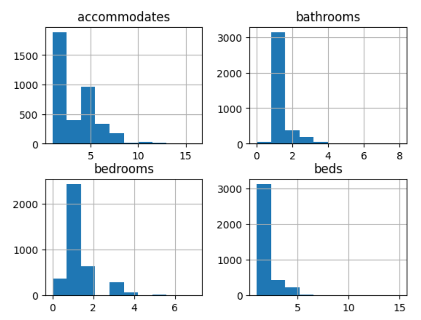
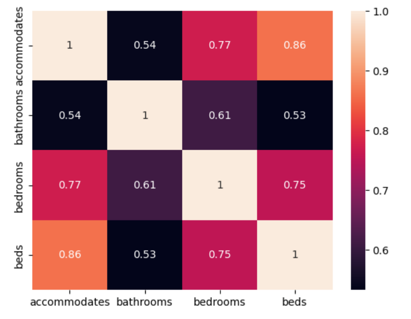
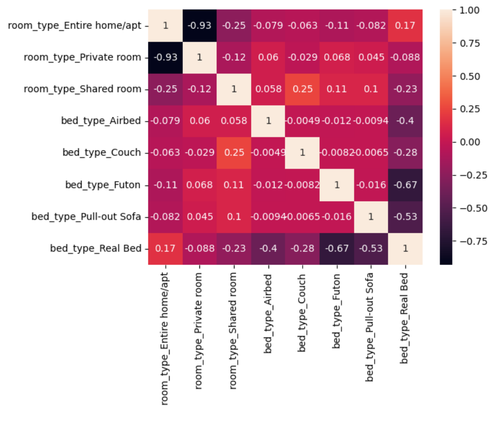

---
title: "Writing my first Data Science Article"
date: 2023-08-28
--

# Writing My First Data Science Article

## Motivation

Actually, the biggest motivation of writing this article is that I want to finish the Udacity course “Introduction to Data Science” which requires me to finish a project at the end. This project is designed to show off my skills as a data scientist. 

To do this, I have to

*	Pick a data set
*	Come up with interesting questions
*	Manipulate the data set to come up with answers. Several ways of what can be done with the data set have been shown in the course.
*	Share my insights. The blog post should be understandable for people in non-technical people.

As my skills are pretty minimal in the moment, I decided to take the people along on my journey.

## First day: Picking the data set.

In retrospect, this was the easiest part. In the course we have been working with the [Stack Overflow Data - 2017 Survey](https://www.kaggle.com/stackoverflow/so-survey-2017) . I decided to take another road and work with [Seattle Airbnb Data](https://www.kaggle.com/airbnb/seattle/data) , which was one of the data sets suggested. 

## Taking the long, windy road through the data-set

### Getting to know the data set

Think of it as exploring a valley. I tried to find out how long and wide it is, which means determining the number of rows (3818) and columns (92). Then I wanted to figure out how certain places are called (the names of the columns). Up to now no real surprises, but then …

### Exploring the data set

Looking at the data types, which for the non-technical people is like if certain columns contain apples or oranges or Brussel sprouts, I realized that certain columns were of a type l did not expect, like the price was not a number, what is going on here?

[Picture1](https://github.com/irenedumkow/irenedumkow.github.io/blob/main/docs/assets/images/picture1.png)

Problem solved, all the columns contain the currency, which makes sense for an international company. (**Learning Nr. 1**)

Trying to figure out if I could learn something interesting about the beds, bedrooms, bathrooms and how many people are accommodated.

 

All columns should have a count of 3818, which leads to **Learning Nr. 2**: Not everybody fills out the information about the bathrooms, bedrooms and beds.

A good way of exploring data is usually to present it in the form of a histogram, this should be easy with the dataset, as all values should be integers. But …

 
Something strange is going on here, I have no idea if the bins are centered, to the left of right of the values or what else. Therefore **Learning Nr. 3**: As an aspiring data scientist, I need to learn more about how the histogram function works to use it properly in the future.

Taking another path and using heat maps on the subset.

 

For the non-technical persons: The ones along the diagonal are normal, the information is in the other fields. For example the field for beds and accommodates is 0.86 which is less than 1, which gives Learning Nr. 4: Some people have to share beds.

Another path to take in our dataset is looking at categorical variables, for example at the room type and bed type. Taking the path as learned in the course I first had **Learning Nr.5**: There are more room types and bed types than I first thought.

Again doing a heat map

 

Compared to the previous heat map, the correlations are a lot lower, but there are some thing to be summed up in **Learning Nr. 6**

*	Entire home/apt somewhat correlated with Real bed, which I expected, but I expected the correlation to be higher.
*	The Private Room does not really correlated with any particular type of bed, I expected the correlation the Real Bed to be higher.
*	For the Shared room, the highest correlations were for provisional bed types like couch, futon and pull out sofa and even negatively for a real bed. Airbed hat the lowest correlations of all provisional bed types, which is surprising because that is what airb&b got its name from.

## Conclusion

It has been in interesting journey through the data set and there is still a lot more to be learned. And it is always good to question your assumptions. I still have a long road to take to become an established data scientist, but I have taken the first of many steps. Dealing with data definitely means “Practice makes perfect” and there are many different roads and turns to take to reach your goal.
